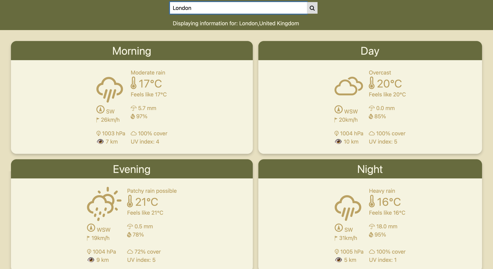

# Weather App

This is a weather web application that utilises the wttr.in API in order to show weather data based on the user's location or the location the user inputs.

# Using the app
When the user loads the webpage, the browser will request location access.
If the user allows access, the user's coordinates are taken and data nearest to that location is fetched.
If the user does not allow for location access, nothing is shown.
The user can then choose to type in a location into the search bar, where the data nearest to the location is fetched and the weather data for morning, noon, evening and night are shown.

# Notes
Depending on the user's device preferences, the app will switch between a light and dark theme accordingly. By default, the webpage will show in light theme.

# Credits
Thank you to [Igor Chubin](https://github.com/chubin), who is the creator of [wttr.in](https://github.com/chubin/wttr.in).

Thank you to [Erik Flowers](https://github.com/erikflowers), who is the creator of the [weather icons](https://github.com/erikflowers/weather-icons/tree/master) used in my project.